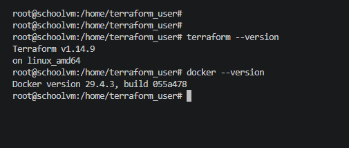

<h1>Домашняя работа</h1>

<h3>Terraform и docker установлены</h3>



<h2>Задание 1</h2>
<h4>1) Каталог скопирован</h4> 
<h4>2) Cогласно .gitignore, допустимо сохранить личную, секретную информацию в файле </h4>


```bash
personal.auto.tfvars 
```
<h4>3) В исходном файле ограничение по версии terraform, а т.к. установлена версия 1.14.9, был изменен код</h4>
Было

```bash
required_version = "~>1.12.0"
```
Стало

```bash
required_version = ">=1.12.0"
```
Также было необходимо изменить значение переменной TF_CLI_CONFIG_FILE, т.к. Terraform по умолчанию ищет файл .terraformrc в корне

```bash
export TF_CLI_CONFIG_FILE=/home/terraform_user/01/src/.terraformrc 
```
Результат запуска кода проекта: 
   

   
Секретное содержимое созданного ресурса random_password:
    
```bash
1JmQn7ujLkXB5y8H
```

   

<h4>4) Результат команды terraform validate</h4>
   

   

<h5>Выявлены 3 намеренно допущенные ошибки</h5>

<h5>Ошибка 1 </h5>
   
Не указано локальное имя по структуре:
   

```bash
resource "<TYPE>" "<LOCAL_NAME>" {
```
Исправлено:

```bash
resource "docker_image" "nginx"{
  name         = "nginx:latest"
  keep_locally = true
}
```

<h5>Ошибка 2 </h5>
  
Некорректное имя ресурса (начало с цифры)
   
```bash
resource "docker_container" "1nginx" {
```

Исправлено на:

```bash
resource "docker_container" "nginx" {
```

<h5>Ошибка 3</h5>

   

Неправильно указана ссылка:

```bash
 name  = "example_${random_password.random_string_FAKE.resulT}"
```

Исправлено на:
c


<h4>5) Исправленный вариант кода:</h4>
   
```bash
terraform {
  required_providers {
    docker = {
      source  = "kreuzwerker/docker"
    }
  }
  required_version = ">=1.12.0" /*Многострочный комментарий.
 Требуемая версия terraform */
}
provider "docker" {}

#однострочный комментарий

resource "random_password" "random_string" {
  length      = 16
  special     = false
  min_upper   = 1
  min_lower   = 1
  min_numeric = 1
}


resource "docker_image" "nginx"{
  name         = "nginx:latest"
  keep_locally = true
}

resource "docker_container" "nginx" {
  image = docker_image.nginx.image_id
  name  = "example_${random_password.random_string.result}"

  ports {
    internal = 80
    external = 9090
  }
}


```


<h4>6) Замена имени docker-контейнера в блоке кода на hello_world </h4>

```bash
resource "docker_container" "nginx" {
  image = docker_image.nginx.image_id
  name  = "Hello_world"
```

Ответ на вопрос:

-auto-approve в основном используется при автоматизации, в скриптах и т.п. из-за того, что есть необходимость запускать проект без подтверждения действия. Опасность данной команды заключается в том, при запуске проекта нет проверки плана из-за этого можно упустить ошибки или случайное удаление ресурсов.

   


<h4>7) Файл terraform.tfstate, после удаления проекта</h4>

   ```bash
{
  "version": 4,
  "terraform_version": "1.14.9",
  "serial": 11,
  "lineage": "5cf24314-8461-0c7b-d93d-0c6f415d487a",
  "outputs": {},
  "resources": [],
  "check_results": null
}

```

<h4>8) Docker-образ nginx:latest был не удален из-за того, что в конфигурационном файле пректа указано следующее: </h4>

```bash
resource "docker_image" "nginx"{
  name         = "nginx:latest"
  keep_locally = true
}
```

Строка **`keep_locally = true`** означает, что образ не будет удален при операции уничтожения 

Строчка из документации terraform провайдера docker:
   
**`keep_locally (Boolean) Если значение true, образ Docker не будет удален при операции уничтожения. Если значение false, образ будет удален из локального хранилища Docker при операции уничтожения.`**

<h2>Задание 2*</h2>
Задание выполнялось по следующему алгоритму:

Сначала в Yandex Cloud была развернута VM
   


Далее на нее была произведена установка terraform и docker
   
**`Установка Terraform:`**
   
```bash
wget https://hashicorp-releases.yandexcloud.net/terraform/1.14.9/terraform_1.14.9_linux_amd64.zip
unzip terraform_1.14.9_linux_amd64.zip
cp -r terraform /usr/local/bin
```

**`Установка Docker:`**
   
```bash
sudo apt update
sudo apt install -y docker.io
sudo systemctl enable docker
sudo usermod -aG docker <username>
```

Далее в директории home/ был создани проект с следующими файлами 

```bash
dz_project/
├── main.tf
├── variables.tf
├── personal.auto.tfvars
├── .gitignore
├── .terraformrc 
```


