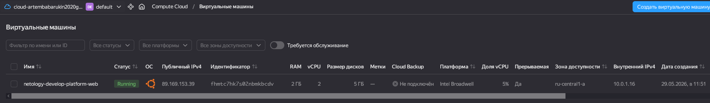
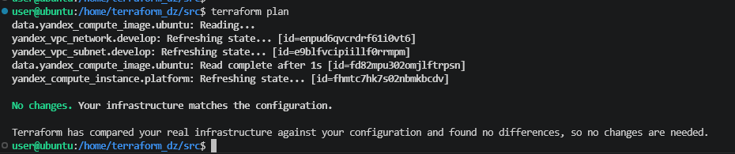
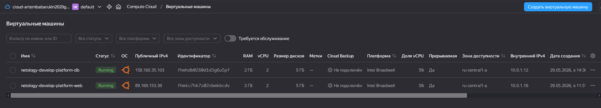
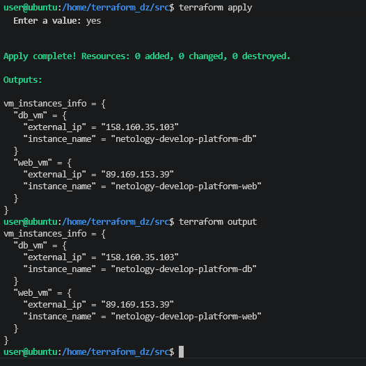
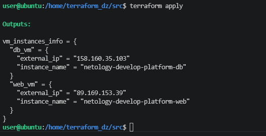

# Домашняя работа  

#### Версия terraform  

``` text
user@ubuntu:/home$ terraform --version
Terraform v1.14.9
on linux_amd64

```  
## Задание 1

1. Изучен файл variables.tf, значения переменных добавлены в файл terraform.tfvars
2. Создан сервисный акк и ключ и пренесен на лок. вм. 
3. Ключ сгенерирован и путь записан в переменную 
**` default     = "<~/.ssh/id_ed25519.pub>" `**
4.  Были выявлены следющие ошибки:
    * ` platform_id = "standart-v4" ` такого значения не может быть т.к. его нет в документации YC https://yandex.cloud/ru/docs/compute/concepts/vm-platforms, поэтому данная строка была замена на значение ` platform_id = "standard-v1"`
    
    * Исправлено количество ядер на 2, т.к. значение `resources {
    cores         = 1 ` не можент быть значение 1 

5. Готовая ВМ в облаке YC

   

Подключение по ssh и вывод команды `curl ifconfig.me`   

    

6. Ответы на вопросы :  
    - `preemptible = true` - данных параметр позволяет отвечает за прервывание ВМ, при его включении, позволяет уменьшить стоимость ВМ, что полезно для тестовых или учебных стендов 
    - `core_fraction = 5` - данных параметр задаёт базовую производительность ядра процессора в процентах, также  позволяет уменьшить стоимость ВМ.

## Задача 2

Созданные пременные  

```hcl

variable "vm_web_family" {
  type        = string
  default     = "ubuntu-2004-lts"
  description = "OC version"
}
variable "vm_web_name" {
  type        = string
  default     = "netology-develop-platform-web"
  description = "name VM"
}
variable "vm_web_platform_id" {
  type        = string
  default     = "standard-v1"
  description = "platform_id"
}
variable "vm_web_cores" {
  type        = string
  default     = "2"
  description = "CPU"
}
variable "vm_web_memory" {
  type        = string
  default     = "2"
  description = "memory GB"
}
variable "vm_web_core_fraction" {
  type        = string
  default     = "5"
  description = "core_fraction %"
}

```   

Добавленные переменные в main   


```hcl

data "yandex_compute_image" "ubuntu" {
  family = var.vm_web_family
}
resource "yandex_compute_instance" "platform" {
  name        = var.vm_web_name
  platform_id = var.vm_web_platform_id
  resources {
    cores         = var.vm_web_cores
    memory        = var.vm_web_memory
    core_fraction = var.vm_web_core_fraction
  }}
```   

Команда `terraform plan` никаких изменений не выдала  

    

## Задача 3   

1. Файл `vms_platform.tf` создан, переменные перенесены.
2. Вторая ВМ создана в файле `main.tf`

```hlc
data "yandex_compute_image" "ubuntu_2" {
  family = var.vm_db_family
}
resource "yandex_compute_instance" "platform_2" {
  name        = var.vm_db_name
  platform_id = var.vm_db_platform_id
  resources {
    cores         = var.vm_db_cores
    memory        = var.vm_db_memory
    core_fraction = var.vm_db_core_fraction
  }
  boot_disk {
    initialize_params {
      image_id = data.yandex_compute_image.ubuntu_2.image_id
    }
  }
  scheduling_policy {
    preemptible = true
  }
  network_interface {
    subnet_id = yandex_vpc_subnet.develop.id
    nat       = true
  }

  metadata = {
    serial-port-enable = 1
    ssh-keys           = "ubuntu:${var.vms_ssh_root_key}"
  }

}
```

Переменные объявлены:

```hlc
variable "vm_db_family" {
  type        = string
  default     = "ubuntu-2004-lts"
  description = "OC version"
}
variable "vm_db_name" {
  type        = string
  default     = "netology-develop-platform-db"
  description = "name VM"
}
variable "vm_db_platform_id" {
  type        = string
  default     = "standard-v1"
  description = "platform_id"
}
variable "vm_db_cores" {
  type        = string
  default     = "2"
  description = "CPU"
}
variable "vm_db_memory" {
  type        = string
  default     = "2"
  description = "memory GB"
}
variable "vm_db_core_fraction" {
  type        = string
  default     = "5"
  description = "core_fraction %"
}
```

3. Изменения применены:

   

## Задача 4   

Дабавлены выводы по двум вм в файл `outputs.tf`

```hcl
output "vm_instances_info" {
  description = "Информация о вм: имя и внешний IP"
  value = {
    web_vm = {
      instance_name = yandex_compute_instance.platform.name
      external_ip   = yandex_compute_instance.platform.network_interface[0].nat_ip_address
    },
    db_vm = {
      instance_name = yandex_compute_instance.platform_2.name
      external_ip   = yandex_compute_instance.platform_2.network_interface[0].nat_ip_address
    }
  }
}
```
Вывод команды `terraform output`:

   

## Задача 5

Код в `local.tf`

```hcl
locals {
  vm_names = {
    web = "${var.project_prefix}-${var.environment}-web"
    db  = "${var.project_prefix}-${var.environment}-db"
  }
}


```
Также добавлены переменные и исправлены значения в файле `main.tf`

`name = local.vm_names.web`

`name = local.vm_names.db`   

Результат:   

 

## Задача 6  

Созданный блок 

```hcl
variable "vm_res" {
  description = "Ресурсы для вм (web и db)"
  type = map(object({
    cores         = number
    memory        = number
    core_fraction = number
    hdd_size      = number
    hdd_type      = string
  }))
}

variable "metadata" {
  description = "Общие метаданные для всех ВМ"
  type = object({
    serial-port-enable = number
    ssh-keys           = string
  })
}
```