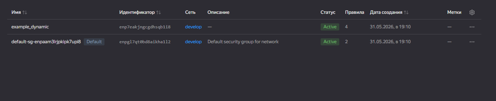
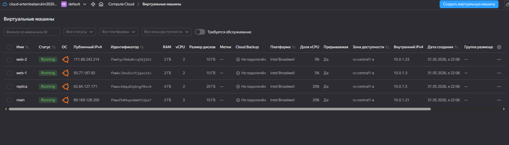
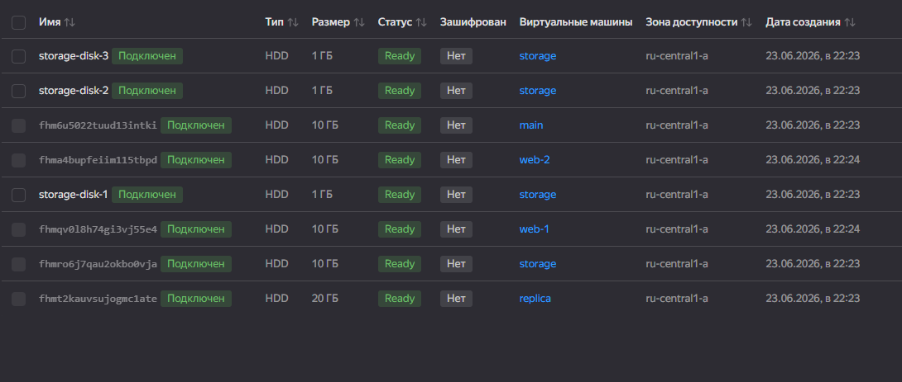
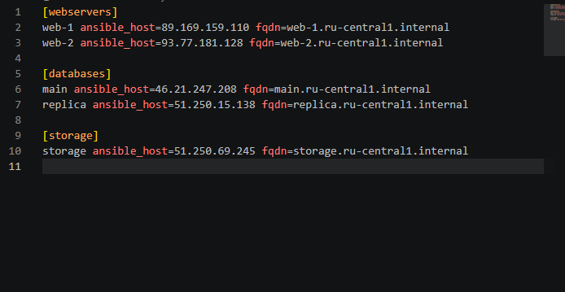

# Домашняя работа   

## Задача 1  

Скриншот входящих правил «Группы безопасности»  



## Задача 2   
Файл `count-vm.tf`  

```hcl
resource "yandex_compute_instance" "web" {
  count = var.vm_count

  name        = "web-${count.index + 1}"
  hostname    = "web-${count.index + 1}"
  platform_id = var.platform_id
  zone        = var.default_zone

  resources {
    cores         = var.vm_res.cores
    memory        = var.vm_res.memory
    core_fraction = var.vm_res.core_fraction
  }

  boot_disk {
    initialize_params {
      image_id = data.yandex_compute_image.ubuntu.image_id
      size     = var.vm_res.disk_volume
      type     = var.vm_res.disk_type
    }
  }

  network_interface {
    subnet_id          = yandex_vpc_subnet.develop.id
    nat                = true
    security_group_ids = [yandex_vpc_security_group.example.id]
  }

  metadata = local.vm_metadata

  scheduling_policy {
    preemptible = true
  }

  depends_on = [
    yandex_compute_instance.db
  ]
}

```   

Файл `for_each-vm.tf`

```hcl
data "yandex_compute_image" "ubuntu" {
  family = var.family_name
}

resource "yandex_compute_instance" "db" {
  for_each = {
    for vm in var.each_vm : vm.vm_name => vm
  }

  name        = each.value.vm_name
  hostname    = each.value.vm_name
  platform_id = var.platform_id
  zone        = var.default_zone

  resources {
    cores         = each.value.cpu
    memory        = each.value.ram
    core_fraction = var.vm_core_fraction
  }

  boot_disk {
    initialize_params {
      image_id = data.yandex_compute_image.ubuntu.image_id
      size     = each.value.disk_volume
      type     = var.vm_disk_type
    }
  }

  network_interface {
    subnet_id          = yandex_vpc_subnet.develop.id
    nat                = true
    security_group_ids = [yandex_vpc_security_group.example.id]
  }

  metadata = local.vm_metadata

  scheduling_policy {
    preemptible = true
  }
}

```   

Результат запуска проекта:



## Задача 3  
Создан файл `disk_vm.tf` со следующим кодом


```hcl
resource "yandex_compute_disk" "storage" {
  count = var.storage_disk_count

  name = "${var.storage_vm_name}-disk-${count.index + 1}"
  type = var.storage_disk_type
  zone = var.default_zone
  size = var.storage_disk_size
}

resource "yandex_compute_instance" "storage" {
  name        = var.storage_vm_name
  hostname    = var.storage_vm_name
  platform_id = var.storage_vm_platform_id
  zone        = var.default_zone

  resources {
    cores         = var.storage_vm_resources.cores
    memory        = var.storage_vm_resources.memory
    core_fraction = var.storage_vm_resources.core_fraction
  }

  boot_disk {
    initialize_params {
      image_id = data.yandex_compute_image.ubuntu.image_id
      size     = var.storage_vm_resources.disk_volume
      type     = var.storage_vm_resources.disk_type
    }
  }

  dynamic "secondary_disk" {
    for_each = yandex_compute_disk.storage

    content {
      disk_id     = secondary_disk.value.id
      auto_delete = true
    }
  }

  network_interface {
    subnet_id          = yandex_vpc_subnet.develop.id
    nat                = true
    security_group_ids = [yandex_vpc_security_group.example.id]
  }

  metadata = local.vm_metadata

  scheduling_policy {
    preemptible = true
  }
}

```
Также в файл variables добавлены новые переменные 

Результат выполнения кода:



## Задача 4
Создано 2 файла `templates/inventory.tftpl` и `ansible.tf`

`inventory.tftpl`

```hcl
[webservers]
%{ for vm in webservers ~}
${vm.name} ansible_host=${vm.external_ip} fqdn=${vm.fqdn}
%{ endfor ~}

[databases]
%{ for vm in databases ~}
${vm.name} ansible_host=${vm.external_ip} fqdn=${vm.fqdn}
%{ endfor ~}

[storage]
%{ for vm in storage ~}
${vm.name} ansible_host=${vm.external_ip} fqdn=${vm.fqdn}
%{ endfor ~}
```
`ansible.tf`

```hcl
locals {
  ansible_webservers = [
    for vm in yandex_compute_instance.web : {
      name        = vm.name
      external_ip = vm.network_interface[0].nat_ip_address
      fqdn        = vm.fqdn
    }
  ]

  ansible_databases = [
    for vm_name in sort(keys(yandex_compute_instance.db)) : {
      name        = yandex_compute_instance.db[vm_name].name
      external_ip = yandex_compute_instance.db[vm_name].network_interface[0].nat_ip_address
      fqdn        = yandex_compute_instance.db[vm_name].fqdn
    }
  ]

  ansible_storage = [
    {
      name        = yandex_compute_instance.storage.name
      external_ip = yandex_compute_instance.storage.network_interface[0].nat_ip_address
      fqdn        = yandex_compute_instance.storage.fqdn
    }
  ]
}

resource "local_file" "ansible_inventory" {
  filename = "${path.module}/inventory.ini"

  content = templatefile("${path.module}/templates/inventory.tftpl", {
    webservers = local.ansible_webservers
    databases  = local.ansible_databases
    storage    = local.ansible_storage
  })
}

```

Результат работы кода `inventory.ini`:  

